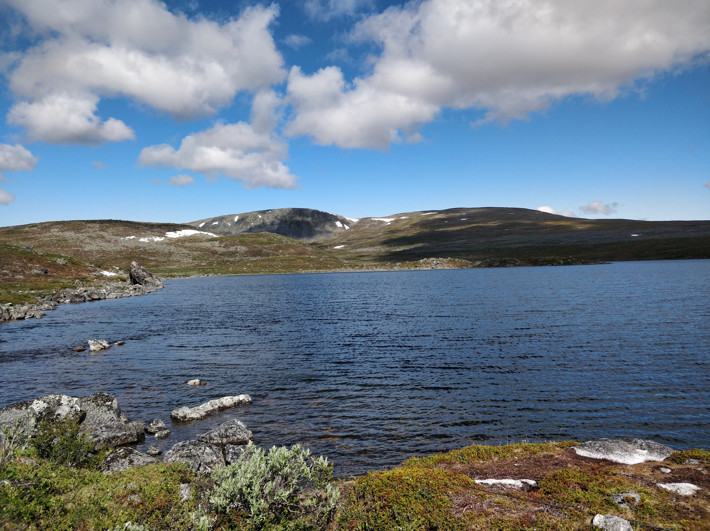

# My Github page

**Ailakkajärvi 2020**

---
Tässä näkyy muutamia esimerkkejä, miten markdown-kieltä voi käyttää web-sivun muotoiluun. 

---
### Linkkejä

- [Cloud Services](https://tl.oamk.fi/cloudservices/) 
- [Markdown Guide](https://www.markdownguide.org/basic-syntax/) 
- [Random Facts](https://fir-task-14240.web.app/) 

